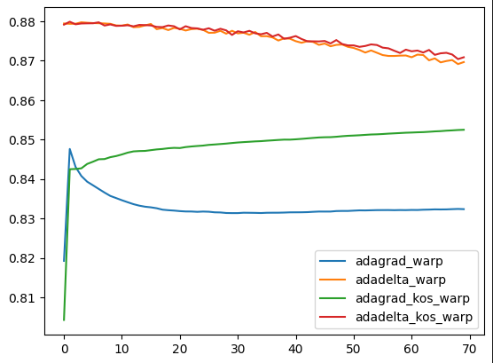
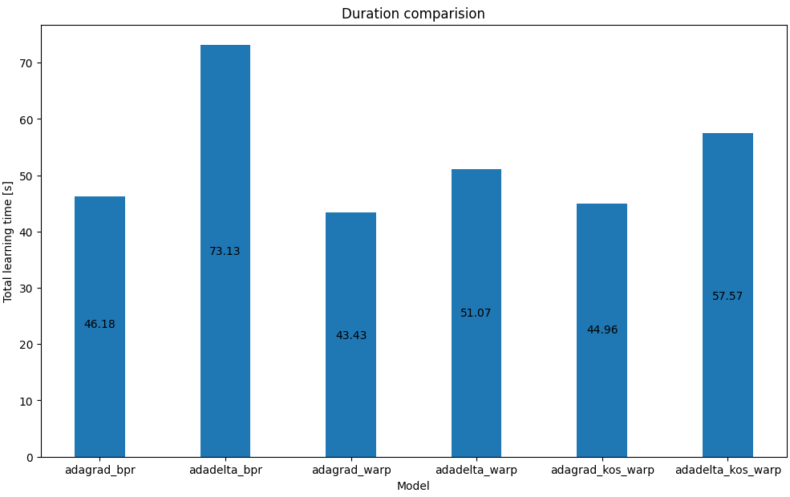

# System rekomendacyjny oparty o model filtrowania kolaboratywnego

## Table of contents
* [Logic applied in application](#Logic-applied-in-application)
* [Setup and istallations](#Setup_and_istallations)
* [Technologies](#Technologies)
* [Examples](#Examples)
* [External sources](#External_sources)

## Logic applied in application
Program creates and trains six recommendation models, with different combinations of loss functions and rate schedules.

## Setup and istallations
Prerequesites: Docker.

1. In order to use the program, first initialize Postgres SQL database, by running following command.
```
docker run --name recommender_system_db -p 5432:5432 -e POSTGRES_PASSWORD=mysecretpassword -d postgres
```
2. Install and build required packages:
```
sudo python3 setup.py build
```
3. Run Jupiter Notebooks in following order:
    1. `recommender_system.ipynb` - to train the models. Amend parameters like number of epochs or alpha value for experiments.
    2. `models_analysis.ipynb` - to visualize models AUC and duration.
    3. `recommendations_generation.ipynb` - to generate users recommendations.

## Technologies

* Docker version: 20.10.17
* Jupyter notebook version: 6.5.4
* LightFM version: 1.17
* Postgres image version: 15.3
* Python version: 3.10.10

## Examples

### AUC metrics comparision



### Duration comparision



## External sources

* [LightFM library documentation](https://making.lyst.com/lightfm/docs/home.html)
